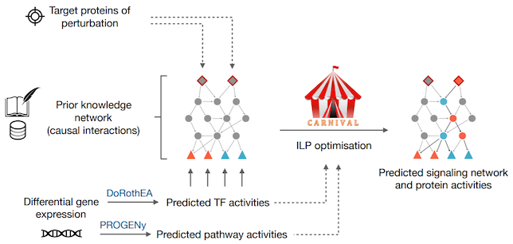

```{r setup, echo=FALSE, results='hide', warning=FALSE, error=FALSE, message=FALSE, cache=FALSE}
library(knitr)
opts_chunk$set(
  cache = FALSE,
  echo = TRUE,
  warning = FALSE,
  error = FALSE,
  message = FALSE
)
```

Introduction
============
While gene expression profiling is commonly used to gain an overview of cellular
processes, the identification of upstream processes that drive expression 
changes remains a challenge. To address this issue, we introduce 
CARNIVAL ([Liu, Trairatphisan, Gjerga et al 2019](https://www.nature.com/articles/s41540-019-0118-z)), 
a causal network contextualization tool which derives network architectures from
gene expression footprints. [CARNIVAL](https://saezlab.github.io/CARNIVAL/) 
(CAusal Reasoning pipeline for Network identification using Integer VALue 
programming) integrates different sources of prior knowledge including signed 
and directed protein-protein interactions, transcription factor targets, and 
pathway signatures.

Pipeline
--------
CARNIVAL refines a quantitative objective function for ILP problem by 
incorporating TF and pathway activities on a continuous scale. In addition, the 
CARNIVAL framework allows us to contextualize the network with or without known 
targets of perturbations. The implementation is separated into two pipelines 
which will be referred henceforth as Standard CARNIVAL StdCARNIVAL (with 
known perturbation targets as an input) and Inverse CARNIVAL InvCARNIVAL 
(without information on targets of perturbation). The differential gene 
expression is used to infer transcription factor (TF) activities with DoRothEA, 
which are subsequently discretized in order to formulate ILPconstraints. As a 
result, CARNIVAL derives a family of highest scoring networks which best explain
the inferred TF activities. Continuous pathway and TF activities can be 
additionally considered in the objective function.




ILP solvers
-----------
CARNIVAL is an extension of the previously implemented Causal Reasoning 
method from [Melas et al.](https://pubs.rsc.org/en/content/articlelanding/2015/ib/c4ib00294f#!divAbstract).
The network inference process is swiftly performed with an Integer Linear 
Programming (ILP) formulation of causal reasoning using four solvers: the 
[R-CRAN lpSolve](https://cran.r-project.org/web/packages/lpSolve/index.html) 
free software used for solving linear problems; the open-source mixed integer 
programming solver [Cbc](https://projects.coin-or.org/Cbc) (Coin-or branch and 
cut); the [CPLEX optimizer](https://www.ibm.com/analytics/cplex-optimizer)
from IBM which can be obtained for free through the Academic Initiative; or
[Gurobi](https://www.gurobi.com/) which also can be obtained for free through
an academic licence. To perform the analysis with cplex or cbc, the users will
then need to store the binary cbc or cplex executables on any  directory they
wish. The binary files of
cbc can be found by first downloading one of the optimization suites
provided here: https://www.coin-or.org/download/binary/OptimizationSuite/,
unzip the download and from there save the cbc executable (which can be
found on the bin directory) file on any of the direcotries they wish of
their machines. As for the cplex, the executable file can be obtained
after registration on the [ILOG CPLEX Optimization Studio]({https://my15.digitalexperience.ibm.com/b73a5759-c6a6-4033-ab6b-d9d4f9a6d65b/dxsites/151914d1-03d2-48fe-97d9-d21166848e65/technology/data-science)
Similar like before, users will have to find the cplex executable binary 
file and save on a directory of their own wish or keep them on their default 
installation paths. The path to interactive version of CPLEX is differed 
based on the operating system. The default installation path for each OS is as 
follows (the path depends on CPLEX version, here is for 12.9):

For Mac OS:
```
    ~/Applications/IBM/ILOG/CPLEX_Studio129/cplex/bin/x86-64_osx/cplex
```

For Linux:
```
    /opt/ibm/ILOG/CPLEX_Studio129/cplex/bin/x86-64_linux/cplex
```

For Windows:
```
    C:/Program Files/IBM/ILOG/CPLEX_Studio129/cplex/bin/x64_win64/cplex.exe
```

Note that the version of CPLEX has to be changed accordingly (the latest
current version is CPLEX-Studio129).

To install Gurobi, executable can be downloaded from [Gurobi downloads
page](https://www.gurobi.com/downloads/gurobi-software/). Similarly to cplex,
the executable location will differ depending on the operating system.

The  lpSolve solver can be used after downloading and installing the
[lpSolve](https://cran.r-project.org/web/packages/lpSolve/index.html) R-package.
This solver only works for smaller examples and it can give only one optimal 
solution. For larger real-case examples, the users can use cbc, cplex or gurobi 
solvers.

Prerequisites
-------------
Besides the above mentioned solvers, users need also to install the following 
R-package dependencies: [readr](https://cran.r-project.org/web/packages/readr/index.html);
[igraph](https://igraph.org/r/); 
[dplyr](https://www.rdocumentation.org/packages/dplyr/versions/0.7.8);
[lpSolve](https://cran.r-project.org/web/packages/lpSolve/index.html)

In order to visualize the automatically generated CARNIVAL networks, 
users will also need to download and install the Graph Visualization software 
[graphviz](https://www.graphviz.org/).

Running CARNIVAL
================
The CARNIVAL package provides the use with five functions to run the Carnival pipeline in a flexible way.
runVanillaCarnival is used to run the standard carnival pipeline with one function, while runInverseCarnival runs inverse Carnival (no input). The generateLPFileCarnival and runCarnivalFromLp  functions  work in tandem and allow the user for example to  obtain the LPFile without running the whole pipeline or create an LPFile from a different source and run the Carnival pipeline with it. These functions also contain multiple parameters to tailor the 

In the CARNIVAL package, built-in examples are available as the test cases as 
follows:

1. A small toy example where the perturbations are known (vanialla CARNIVAL flavour)

2. A small toy example where the perturbations are not known (inverse CARNIVAL flavour)

3. A small toy example to run with two functions (vanilla CARNIVAL flavour)


The Data of these toy examples looks as follows:

* Two input Nodes I1 and I2 connected to the nodes N1 and N2 respectively
* N1 and N2 are connected to both measured Nodes M1 and M2 
* All connections beside I2 to N2 are activatory

Toy Example - 1
---------------
Toy example for the CARNIVAL standard pipeline:

```{r}
library(CARNIVAL)
load(file = system.file("toy_perturbations_ex1.RData",
                        package = "CARNIVAL"))
load(file = system.file("toy_measurements_ex1.RData",
                        package = "CARNIVAL"))
load(file = system.file("toy_network_ex1.RData",
                        package = "CARNIVAL"))

carnivalOptions <- defaultLpSolveCarnivalOptions()

# Output dir
dir.create("ToyExample1", showWarnings = FALSE)
carnivalOptions$outputFolder <- "ToyExample1"

# lpSolve
resultsLpSolve <- runVanillaCarnival( perturbations = toy_perturbations_ex1, 
                                      measurements = toy_measurements_ex1,
                                      priorKnowledgeNetwork = toy_network_ex1, 
                                      carnivalOptions = carnivalOptions)

```
which generates the following output:
```{r}
print(resultsLpSolve)
```
The output from CARNIVAL can be saved in `Rds` format like so:
```{r}
saveRDS(resultsLpSolve, "ToyExample1/network_solution.Rds")
```

Toy Example - 2
---------------
Toy example for the CARNIVAL inverted pipeline:

```{r}
load(file = system.file("toy_measurements_ex2.RData",
                        package="CARNIVAL"))
load(file = system.file("toy_network_ex2.RData",
                        package="CARNIVAL"))

carnivalOptions <- defaultLpSolveCarnivalOptions()

# Output dir
dir.create("ToyExample2", showWarnings = FALSE)
carnivalOptions$outputFolder <- "ToyExample2"

# lpSolve
toy_network_ex2 <- as.data.frame(toy_network_ex2)
colnames(toy_network_ex2) <- c("source", "interaction", "target")
toy_measurements_ex2 <- c("M1" = 1, "M2" = 1, "M3" = 1)

inverseCarnivalResults <- runInverseCarnival( measurements = c(toy_measurements_ex2), 
                                              priorKnowledgeNetwork = toy_network_ex2, 
                                              carnivalOptions = carnivalOptions)
```
which generates the following output:
```{r}
print(inverseCarnivalResults)
```

Toy Example - 3
---------------
Toy example for the CARNIVAL standard pipeline with generateLPFileCarnival and runCarnivalFromLp:

```{r}

load(file = system.file("toy_perturbations_ex1.RData",
                        package = "CARNIVAL"))
load(file = system.file("toy_measurements_ex1.RData",
                        package = "CARNIVAL"))
load(file = system.file("toy_network_ex1.RData",
                        package = "CARNIVAL"))

carnivalOptions <- defaultLpSolveCarnivalOptions()

# Output dir
dir.create("ToyExample3", showWarnings = FALSE)
carnivalOptions$outputFolder <- "ToyExample3"

# lpSolve
generateLpFileCarnival(perturbations = toy_perturbations_ex1,
                       measurements = toy_measurements_ex1, 
                       priorKnowledgeNetwork = toy_network_ex1, 
                       carnivalOptions = carnivalOptions)

```
which writes two files, an Lp File and a parsed Data file. The next function takes these files as inputs and runs the vanilla (standard) CARNIVAL pipeline with them. 
```{r}

lpFilename <- "toy_files_vignettes/lpFile_t18_01_53d28_04_2021n4.lp"
parsedDataFile <- "toy_files_vignettes/parsedData_t18_01_53d28_04_2021n4.RData"
resultsFromLp <- runFromLpCarnival(lpFile = lpFilename,
                                   parsedDataFile = parsedDataFile,
                                   carnivalOptions = defaultLpSolveCarnivalOptions())
```
which generates the following output:

```{r}
resultsFromLp
```

Gurobi remote services
----------------------

When using Gurobi solver, it is possibe to distribute the optimisation amongst
multiple nodes of a computing cluster using the [Gurobi remote
services](https://www.gurobi.com/documentation/9.1/remoteservices/using_remote_services.html). 

Gurobi remote services need to be set up by a system administrator of a cluster.

To use multiple cluster nodes when using gurobi in CARNIVAL, add the following 
options to `carnivalOptions` parameter:
```r
distributed=TRUE,
WorkerPassword="<password>",
```
where `<password>` is given by cluster system administrator. The number of
nodes will need to be specified through workload a workload manager, such as
[slurm](https://slurm.schedmd.com/overview.html).

```{r}
sessionInfo()
```
